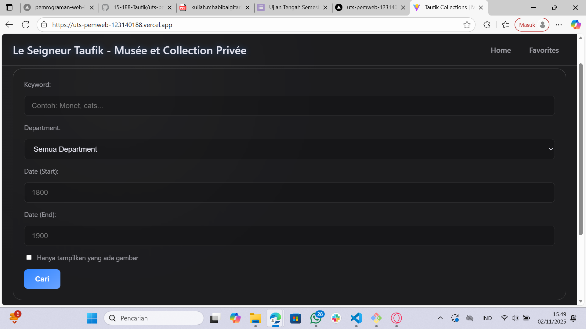
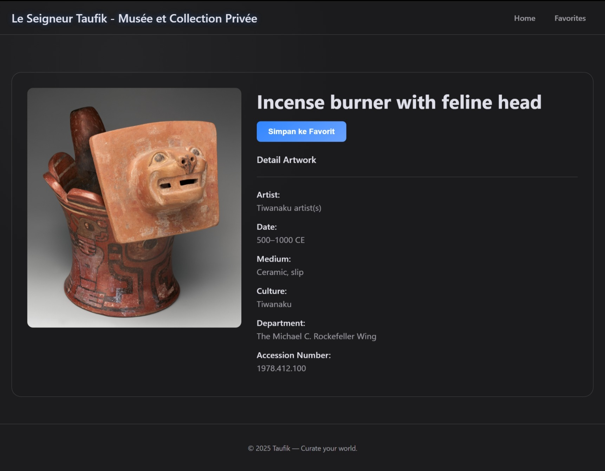
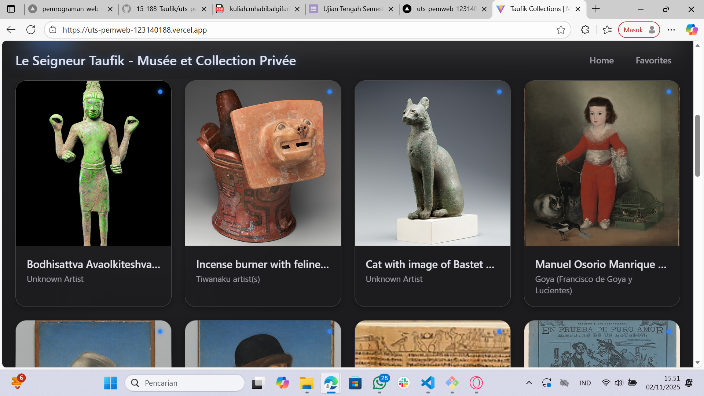

# 🏛️ Taufik Collections - Museum Explorer

Ini adalah proyek *take-home* UTS (Ujian Tengah Semester) untuk mata kuliah Pengembangan Aplikasi Web. Aplikasi ini adalah *explorer* koleksi museum yang dibuat menggunakan React.js dan API dari Metropolitan Museum of Art (Met Museum).


---

## 👨‍💻 Identitas Pengembang

- **Nama:** Taufik Hidayat NST
- **NIM:** 123140188

---

## 🚀 Link Deployment Vercel

Aplikasi ini telah di-deploy dan dapat diakses secara publik melalui Vercel:

➡️ **https://uts-pemweb-123140188.vercel.app/**

---

## ✨ Fitur Utama

- **Pencarian & Filter:** Cari karya seni berdasarkan *keyword* dan filter berdasarkan departemen (data diambil dinamis dari API).
- **Galeri Kaca:** Tampilan galeri *responsive* dengan efek *glassmorphism*.
- **Halaman Detail:** Klik pada sebuah karya untuk melihat detail lengkapnya, termasuk artis, tahun, medium, dan budaya.
- **Koleksi Favorit:** Simpan karya seni favorit Anda. Data favorit disimpan secara persisten di `localStorage` browser.
- **Tabel Favorit:** Halaman favorit menampilkan koleksi dalam bentuk tabel dinamis yang rapi.

---

## 🛠️ Teknologi yang Digunakan

- **Frontend:** React.js (Vite)
- **Routing:** React Router DOM
- **Styling:** CSS Murni (Glassmorphism, Flexbox, CSS Grid)
- **API:** Metropolitan Museum of Art (Met Museum) API
- **State Management:** React Hooks (`useState`, `useEffect`)
- **Deployment:** Vercel

---

## 📸 Screenshot Aplikasi

Berikut adalah beberapa tampilan dari aplikasi:

### 1. Halaman Pencarian & Galeri (Home)
*Tampilan utama untuk mencari dan melihat galeri koleksi.*


### 2. Tampilan Detail Karya
*Halaman yang muncul saat satu karya seni dipilih.*


### 3. Galeri dengan Hasil Pencarian
*Contoh galeri saat menampilkan hasil pencarian.*


### 4. Halaman Koleksi Favorit
*Tabel yang menampilkan karya-karya yang telah disimpan.*


---

## ⚙️ Cara Instalasi & Menjalankan Lokal

Untuk menjalankan proyek ini di komputer lokal Anda, ikuti langkah-langkah berikut:

**1. Clone Repositori**
Buka terminal Anda dan clone repositori ini:
```bash
git clone [https://github.com/15-188-Taufik/uts-pemweb-123140188.git](https://github.com/15-188-Taufik/uts-pemweb-123140188.git)
//2. Masuk ke Direktori Proyek
cd uts-pemweb-123140188
//3. Install Dependencies Gunakan npm untuk menginstal semua package yang dibutuhkan:
npm install
//4. Jalankan Development Server Setelah instalasi selesai, jalankan server pengembangan Vite:
npm run dev
//5. Buka Aplikasi Buka browser Anda dan akses http://localhost:5173 (atau port lain yang ditampilkan di terminal).
